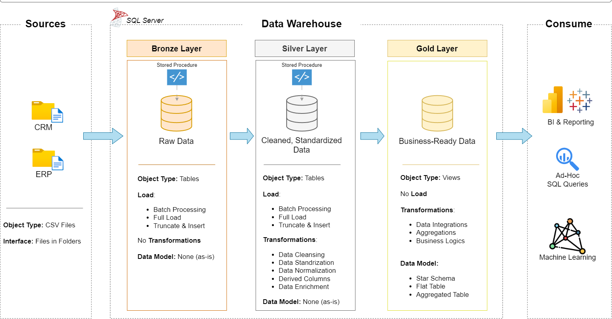

# 🚀 SQL Data Warehouse Project (Medallion Architecture)

## 📌 Overview
This project demonstrates the design and implementation of a **scalable and modular data warehouse** using the Medallion Architecture (Bronze, Silver, Gold layers).

The pipeline ingests raw data, performs data cleaning and transformations, and delivers **business-ready analytical datasets** for reporting and decision-making.

---

## 🏗️ Architecture

**Data Flow:**  
Source Data → Bronze → Silver → Gold → Analytics  

- **Bronze Layer** → Raw data ingestion (no transformations)  
- **Silver Layer** → Data cleaning, validation, and transformation  
- **Gold Layer** → Business-ready data modeled as Fact & Dimension tables  

---

## 🖼️ Architecture Diagram


---

## 🛠️ Tech Stack
- SQL Server (Data Warehouse)
- T-SQL (ETL & Transformations)
- Medallion Architecture
- Data Modeling (Star Schema)

---

## ⚙️ Key Features
- ✅ Layered data pipeline (Bronze → Silver → Gold)
- ✅ Bulk data ingestion using SQL stored procedures
- ✅ Data cleaning and transformation logic
- ✅ Star schema design (Fact & Dimension tables)
- ✅ Data quality checks for validation
- ✅ Modular and scalable SQL scripts

---
## 📂 Project Structure
This section outlines the organization of the project files and directories:

```plaintext
Sql-Data-Warehouse-Project1/
├── datasets/          # Contains raw source data files (CSV format)
├── docs/              # Includes architecture diagrams and documentation
├── scripts/           # All SQL scripts organized by layers
│   ├── bronze/        # Raw data ingestion scripts (BULK INSERT)
│   ├── silver/        # Data cleaning and transformation scripts
│   ├── gold/          # Analytical layer (fact & dimension tables)
│   ├── init.sql       # Database and schema initialization
│   ├── proc_load_bronze.sql   # Stored procedure to load Bronze layer
│   ├── proc_load_silver.sql   # Stored procedure to load Silver layer
│   ├── proc_load_gold.sql     # Stored procedure to load Gold layer
├── tests/             # Data quality validation queries
└── README.md          # Project documentation
```
## 🔄 Execution Flow

Run the scripts in the following order:

1. init.sql  
2. ddl_bronze.sql  
3. proc_load_bronze.sql  
4. ddl_silver.sql  
5. proc_load_silver.sql  
6. ddl_gold.sql  
7. Data quality checks  

---

## 📊 Data Modeling

Implemented **Star Schema**:

- **Fact Tables** → Sales data  
- **Dimension Tables** → Customer, Product  

---

## 📊 Sample Output

```sql
SELECT * FROM gold.fact_sales;
```
| order_number | customer_key | product_key | sales_amount |
| ------------ | ------------ | ----------- | ------------ |
| 1001         | 1            | 10          | 5000         |


## 📈 Business Use Case

This data warehouse enables:

- 📊 Sales performance analysis  
- 👤 Customer behavior insights  
- 📦 Product-level analytics  
- 📉 Efficient reporting and dashboard integration  

---

## 🧪 Data Quality Validation

The project includes SQL-based quality checks to ensure:

- No duplicate or null keys  
- Valid date ranges  
- Consistent business logic (sales = quantity × price)  
- Clean and standardized data  

---

## ⚠️ Setup Note

Update file paths in `proc_load_bronze.sql` before execution:

```sql
SET @base_path = 'your_project_path\datasets\';
```
## 🧠 *Key Learnings*
- Designed scalable data pipelines using Medallion Architecture
- Built ETL workflows using T-SQL
Implemented Star Schema for analytical querying
Applied data validation and quality checks
## 🚀 *Future Improvements*
Implement incremental data loading
Automate pipeline using Airflow / Azure Data Factory
Integrate BI dashboards (Power BI / Tableau)
Optimize query performance
## 📜 *License*

This project is licensed under the MIT License.

## 👨‍💻 *Author*

Uday Kumar
Aspiring Software Engineer | Data Enthusiast
